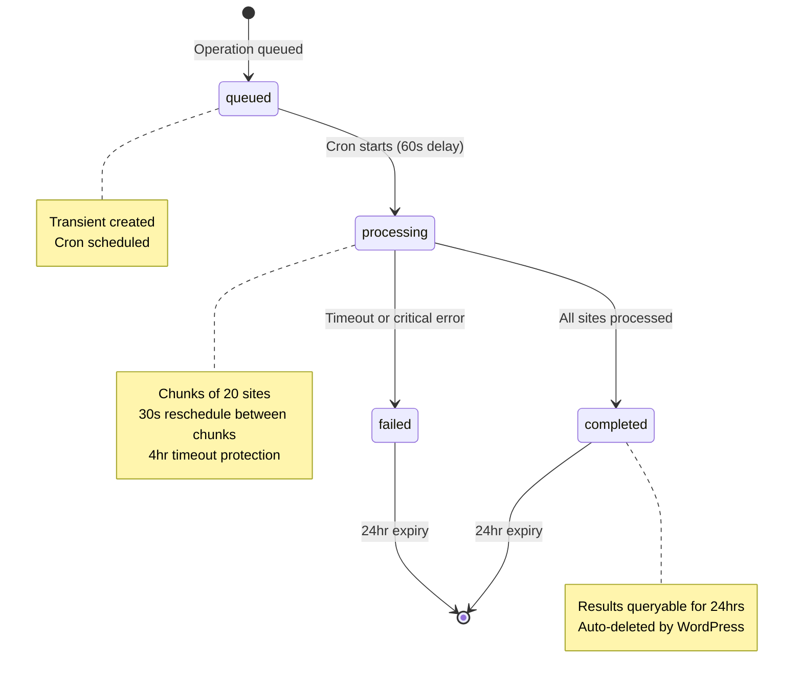

# MainWP Abilities API - Developer Documentation

Version: 1.0  
Last Updated: 2025-12-03

## Overview

The MainWP Abilities API provides a standardized, schema-validated interface for managing MainWP child sites, updates, clients, and tags. Built on WordPress's Abilities API (introduced in WP 6.9), it enables secure, discoverable operations for MCP tools, REST API consumers, and extensions.

**Key Features:**
- 62 abilities across 5 categories
- JSON Schema validation for inputs (outputs documented but not enforced)
- Permission callbacks with per-site ACLs
- Batch operation support with automatic queuing
- Feature-gated module integration (Cost Tracker, Logs)
- Comprehensive error handling with standardized codes

## Architecture

### Bootstrap Flow

1. **Initialization** (`MainWP_Abilities::init()`)
   - Cron handlers initialize unconditionally via `MainWP_Abilities_Cron::instance()` to process any previously queued batch jobs (even if Abilities API is later disabled)
   - Feature detection: if `wp_register_ability` does not exist, skip remaining initialization
   - When Abilities API is available: hook into `wp_abilities_api_categories_init` and `wp_abilities_api_init`

2. **Category Registration** (`MainWP_Abilities::register_categories()`)
   - Register 5 categories: mainwp-sites, mainwp-updates, mainwp-clients, mainwp-tags, mainwp-batch
   - Each category has label and description for discoverability

3. **Ability Registration** (`MainWP_Abilities::register_abilities()`)
   - Call `::register()` on each ability class
   - Each class registers its abilities via `wp_register_ability()`

4. **Execution** (per ability)
   - Abilities API validates input against `input_schema`
   - Calls permission callback (checks `manage_options` + site access)
   - Calls execute callback (delegates to MainWP core logic)
   - Returns output (documented by `output_schema` for tooling, not enforced at runtime)

### File Structure

```
includes/abilities/
├── class-mainwp-abilities.php          # Bootstrap
├── class-mainwp-abilities-util.php     # Shared utilities
├── class-mainwp-abilities-sites.php    # 30 site abilities
├── class-mainwp-abilities-updates.php  # 13 update abilities
├── class-mainwp-abilities-clients.php  # 11 client abilities
├── class-mainwp-abilities-tags.php     # 7 tag abilities
├── class-mainwp-abilities-batch.php    # 1 batch job status ability
└── README.md                           # This file
```

## Registration Patterns

### Adding a New Ability

Follow this pattern (example: `mainwp/example-ability-v1`):

**Step 1: Create registration method**
```php
private static function register_example_ability(): void {
    if ( ! function_exists( 'wp_register_ability' ) ) {
        return;
    }

    wp_register_ability(
        'mainwp/example-ability-v1',
        array(
            'label'              => __( 'Example Ability', 'mainwp' ),
            'description'        => __( 'Description of what this ability does. Possible errors: mainwp_example_error.', 'mainwp' ),
            'category'           => 'mainwp-sites',
            'input_schema'       => self::get_example_input_schema(),
            'output_schema'      => self::get_example_output_schema(),
            'execute_callback'   => array( static::class, 'execute_example_ability' ),
            'permission_callback' => MainWP_Abilities_Util::get_manage_sites_permission_callback(),
            'meta'               => array(
                'annotations' => array(
                    'readonly'    => false,
                    'destructive' => false,
                    'idempotent'  => true,
                ),
            ),
        )
    );
}
```

**Step 2: Define input schema**
```php
private static function get_example_input_schema(): array {
    return array(
        'type'       => 'object',
        'properties' => array(
            'site_id_or_domain' => array(
                'type'        => array( 'integer', 'string' ),
                'description' => __( 'Site ID or domain.', 'mainwp' ),
            ),
            'example_param' => array(
                'type'        => 'string',
                'description' => __( 'Example parameter.', 'mainwp' ),
                'default'     => 'default_value',
            ),
        ),
        'required'   => array( 'site_id_or_domain' ),
    );
}
```

**Step 3: Define output schema**
```php
private static function get_example_output_schema(): array {
    return array(
        'type'       => 'object',
        'properties' => array(
            'success' => array(
                'type'        => 'boolean',
                'description' => __( 'Whether operation succeeded.', 'mainwp' ),
            ),
            'data' => array(
                'type'        => 'object',
                'description' => __( 'Result data.', 'mainwp' ),
            ),
        ),
        'required'   => array( 'success' ),
    );
}
```

**Step 4: Implement execute callback**
```php
public static function execute_example_ability( $input ) {
    $input = MainWP_Abilities_Util::normalize_input( $input, array(
        'example_param' => 'default_value',
    ) );

    $site = MainWP_Abilities_Util::resolve_site( $input['site_id_or_domain'] );
    if ( is_wp_error( $site ) ) {
        return $site;
    }

    $access_check = MainWP_Abilities_Util::check_site_access( $site->id );
    if ( is_wp_error( $access_check ) ) {
        return $access_check;
    }

    $result = SomeMainWPClass::do_something( $site->id, $input['example_param'] );

    return array(
        'success' => true,
        'data'    => $result,
    );
}
```

**Step 5: Add to `register()` method**
```php
public static function register(): void {
    self::register_example_ability();
}
```

**Step 6: Create test file**
Create `tests/abilities/test-example-ability.php` with 5 required tests (see Testing Requirements section).

## Versioning Policy

### When to Increment Version

**Increment version (v1 → v2) for:**
- Removing required output fields
- Changing field types (e.g., `string` → `integer`)
- Removing input parameters
- Changing default behavior in breaking ways

**Keep same version for:**
- Adding optional output fields
- Adding optional input parameters with defaults
- Bug fixes that don't change schema
- Performance improvements

### Deprecation Process

1. **Mark as deprecated** in ability meta:
```php
'meta' => array(
    'deprecated'         => true,
    'deprecated_message' => __( 'Use mainwp/list-sites-v2 instead.', 'mainwp' ),
    'sunset_version'     => '5.0',
),
```

2. **Maintenance window**: Deprecated versions maintained for **2 major MainWP releases**

3. **Removal**: After sunset version, ability is removed from registration

### Version Coexistence

Multiple versions can coexist:
- `mainwp/list-sites-v1` (deprecated)
- `mainwp/list-sites-v2` (current)

Consumers can migrate at their own pace during the maintenance window.

## Error Code Conventions

### Abilities API Error Codes

The WordPress Abilities API (not MainWP-specific) may return these error codes:

| Code | HTTP Status | Usage |
|------|-------------|-------|
| `ability_invalid_input` | 400 | Input fails JSON Schema validation |
| `ability_missing_input_schema` | 400 | Ability has no input schema but received input |
| `ability_invalid_permissions` | 403 | Permission callback returned false |

### MainWP Error Codes

All MainWP-specific error codes use the `mainwp_*` prefix:

| Code | HTTP Status | Usage |
|------|-------------|-------|
| `mainwp_site_not_found` | 404 | Site ID/domain doesn't exist |
| `mainwp_client_not_found` | 404 | Client ID/email doesn't exist |
| `mainwp_tag_not_found` | 404 | Tag ID doesn't exist |
| `mainwp_job_not_found` | 404 | Batch job ID doesn't exist |
| `mainwp_permission_denied` | 401/403 | User lacks authentication or manage_options capability |
| `mainwp_access_denied` | 403 | User lacks permission to specific site (per-site ACL) |
| `mainwp_invalid_input` | 400 | Application-level input validation failed (beyond schema) |
| `mainwp_confirmation_required` | 400 | Destructive op missing confirm:true |
| `mainwp_ambiguous_site` | 400 | Multiple sites match identifier |
| `mainwp_already_exists` | 409 | Resource already exists |
| `mainwp_sync_in_progress` | 409 | Site already being synced |
| `mainwp_no_updates` | 400 | No updates available for requested operation |
| `mainwp_module_not_available` | 501 | Required module not active |
| `mainwp_site_offline` | 503 | Site unreachable |
| `mainwp_operation_failed` | 500 | Generic operation failure |
| `mainwp_internal_error` | 500 | Unexpected internal error |
| `mainwp_client_creation_failed` | 500 | Failed to create client |
| `mainwp_client_update_failed` | 500 | Failed to update client |
| `mainwp_client_deletion_failed` | 500 | Failed to delete client |

### Error Response Format

```php
return new WP_Error(
    'mainwp_site_not_found',
    __( 'Site with ID 123 not found.', 'mainwp' ),
    array( 'status' => 404 )
);
```

### Documenting Errors

List possible error codes in ability description:
```php
'description' => __(
    'Get detailed information about a single MainWP child site. ' .
    'Possible errors: mainwp_site_not_found, mainwp_permission_denied, mainwp_access_denied.',
    'mainwp'
),
```

## Testing Requirements

### 5 Required Tests (Per Ability)

Every ability must have these tests in `tests/abilities/test-{ability-name}-ability.php`:

1. **`test_ability_is_registered()`**
   - Verify ability exists via `wp_get_ability()`
   - Check category, label, description

2. **`test_{ability}_returns_expected_structure()`**
   - Happy path with valid input
   - Assert output matches schema

3. **`test_{ability}_requires_authentication()`**
   - Call as unauthenticated user
   - Assert `mainwp_permission_denied` error (401 status)

4. **`test_{ability}_requires_manage_options()`**
   - Call as subscriber (low privilege)
   - Assert `mainwp_permission_denied` error (403 status)

5. **`test_{ability}_validates_input()`**
   - Call with invalid input
   - Assert `ability_invalid_input` error

**Note on Output Validation**: The Abilities API validates inputs at runtime but does not enforce output schemas. The `output_schema` serves as documentation for MCP tools and REST consumers. Tests must verify that actual output conforms to the documented schema. Use formatter helpers (`MainWP_Abilities_Util::format_*_for_output()`) to ensure consistency.

### Additional Tests for Destructive Abilities

Abilities with `destructive: true` annotation must also test:

6. **`test_{ability}_dry_run_returns_preview()`**
   - Call with `dry_run: true`
   - Assert preview structure

7. **`test_{ability}_rejects_dry_run_and_confirm_together()`**
   - Call with both flags
   - Assert `mainwp_invalid_input` error

8. **`test_{ability}_requires_confirmation()`**
   - Call without `confirm: true`
   - Assert `mainwp_confirmation_required` error

### Additional Tests for Batch Abilities

Abilities processing multiple sites should test:

9. **`test_{ability}_handles_partial_failure()`**
   - Mix of valid and invalid sites
   - Assert both `synced` and `errors` arrays

10. **`test_{ability}_queues_large_batches()`**
    - Call with >200 sites
    - Assert `queued: true` and `job_id` returned

### Test Template

Use `tests/abilities/TEMPLATE-ability-test.php.dist` as starting point.

## Formatter Standards

### Signature Convention

All formatters in `MainWP_Abilities_Util` follow this pattern:

```php
public static function format_{resource}_for_output( $object, array $options = array() ): array
```

### Common `$options` Keys

| Option | Type | Description |
|--------|------|-------------|
| `context` | `'view'` \| `'edit'` | Controls field visibility |
| `include_stats` | `bool` | Include computed statistics |
| `include_{relation}` | `bool` | Include related data (e.g., `include_sites`) |

### Examples

**Site formatter:**
```php
$formatted = MainWP_Abilities_Util::format_site_for_output( $site, array(
    'context'       => 'view',
    'include_stats' => true,
) );
```

**Client formatter:**
```php
$formatted = MainWP_Abilities_Util::format_client_for_output( $client, array(
    'context'       => 'view',
    'include_sites' => false,
) );
```

**Plugin formatter:**
```php
$formatted = MainWP_Abilities_Util::format_plugin_for_output( $plugin, array(
    'context' => 'view',
) );
```

### Implementing a New Formatter

```php
public static function format_example_for_output( $object, array $options = array() ): array {
    $options = wp_parse_args( $options, array(
        'context'       => 'view',
        'include_stats' => false,
    ) );

    $output = array(
        'id'   => (int) $object->id,
        'name' => $object->name,
    );

    if ( 'edit' === $options['context'] ) {
        $output['internal_field'] = $object->internal_field;
    }

    if ( $options['include_stats'] ) {
        $output['stats'] = self::calculate_stats( $object );
    }

    return $output;
}
```

## Batch Processing

### Overview

Abilities that process multiple sites (sync, updates, reconnect, disconnect, check, suspend) automatically queue large operations to prevent timeouts and resource exhaustion. This section explains threshold behavior, job lifecycle, WordPress cron requirements, and operational considerations.

### Threshold Behavior

Operations follow this pattern based on site count:

| Site Count | Behavior | Response |
|------------|----------|----------|
| ≤200 sites | Execute synchronously | Immediate results with `synced` and `errors` arrays |
| >200 sites | Queue for background processing | `{ "queued": true, "job_id": "sync_abc123", "total": 250 }` |

**Threshold Override:**

```php
add_filter( 'mainwp_abilities_batch_threshold', function( $threshold ) {
    return 100; // Lower threshold for resource-constrained hosts
} );
```

### Queuing Mechanism

Large batches are queued via `MainWP_Abilities_Util::queue_batch_operation()`:

```php
if ( count( $sites ) > $threshold ) {
    $job_id = MainWP_Abilities_Util::queue_batch_operation( 'sync', $sites );
    return array(
        'queued'    => true,
        'job_id'    => $job_id,
        'total'     => count( $sites ),
        'message'   => __( 'Batch operation queued. Use mainwp/get-batch-job-status-v1 to check progress.', 'mainwp' ),
    );
}
```

Jobs are stored as WordPress transients with 24-hour expiration:
- `mainwp_sync_job_{job_id}` - Site sync operations
- `mainwp_update_job_{job_id}` - Update operations
- `mainwp_batch_job_{job_id}` - Generic batch operations (reconnect, disconnect, etc.)

### Job Status Polling

Use `mainwp/get-batch-job-status-v1` to monitor progress:

```php
$status = wp_execute_ability( 'mainwp/get-batch-job-status-v1', array(
    'job_id' => 'sync_abc123',
) );
```

**Response structure:**

```php
array(
    'job_id'       => 'sync_abc123',
    'type'         => 'sync',
    'status'       => 'processing',  // queued | processing | completed | failed
    'progress'     => 65,             // Percentage (0-100)
    'processed'    => 33,             // Sites processed so far
    'total'        => 50,             // Total sites in batch
    'succeeded'    => 30,             // Successfully processed
    'failed'       => 3,              // Failed sites
    'started_at'   => '2025-12-03T10:00:00Z',
    'completed_at' => null,           // null until completed/failed
    'errors'       => array(          // Per-site errors
        array(
            'site_id' => 42,
            'code'    => 'mainwp_site_offline',
            'message' => 'Site is not reachable.',
        ),
    ),
)
```

### Job Lifecycle and Retention



**Storage and Expiration:**
- Jobs stored as WordPress transients with **24-hour TTL** (`DAY_IN_SECONDS`)
- After 24 hours, jobs auto-expire and return `mainwp_job_not_found` (404)
- No manual cleanup required—WordPress handles expiration
- Completed/failed jobs remain queryable for full 24 hours for debugging

**Cron Processing:**
- Queued jobs schedule single cron event (`mainwp_process_sync_job`, `mainwp_process_update_job`, `mainwp_process_batch_job`)
- Initial delay: 60 seconds after queuing
- Chunk size: 20 sites per cron run (filterable via `mainwp_abilities_cron_chunk_size`)
- Reschedule delay: 30 seconds between chunks
- Timeout protection: Jobs fail after 4 hours

### WordPress Cron Requirements

⚠️ **Critical:** WordPress cron requires site traffic to fire events. For production environments with batch operations:

**Recommended Setup:**
```bash
# Disable WordPress cron in wp-config.php
define( 'DISABLE_WP_CRON', true );

# Add real cron job (runs every minute)
* * * * * cd /path/to/wordpress && wp cron event run --due-now > /dev/null 2>&1
```

**Without real cron:**
- Jobs remain `queued` until site receives traffic
- Processing may be delayed or never start on low-traffic sites
- 24-hour expiration still applies—jobs can expire before processing

**Check cron health:**
```bash
wp cron event list
wp cron test
```

### Partial Failure Handling

Batch operations continue processing all items even if some fail (no `fail_fast` parameter):

```php
return array(
    'synced' => array(
        array( 'id' => 1, 'url' => 'https://site1.com/', 'name' => 'Site 1' ),
        array( 'id' => 3, 'url' => 'https://site3.com/', 'name' => 'Site 3' ),
    ),
    'errors' => array(
        array(
            'identifier' => 2,
            'code'       => 'mainwp_site_offline',
            'message'    => 'Site is not reachable.',
        ),
        array(
            'identifier' => 'example.com',
            'code'       => 'mainwp_sync_failed',
            'message'    => 'Sync operation timed out.',
        ),
    ),
    'total_synced' => 2,
    'total_errors' => 2,
);
```

### Operational Considerations

**Job Ephemerality:**
- Batch jobs are **ephemeral** (24-hour lifespan)
- Not suitable for long-term audit trails
- May be lost during server restarts or cache flushes (transient storage)
- For critical operations, implement external logging/monitoring

**Troubleshooting Stuck Jobs:**

1. **Check cron health:**
   ```bash
   wp cron event list | grep mainwp_process
   ```

2. **Manually trigger stuck job:**
   ```bash
   wp cron event run mainwp_process_sync_job <job_id>
   ```

3. **Clear stuck job:**
   ```php
   delete_transient( 'mainwp_sync_job_abc123' );
   ```

4. **Monitor job queue size:**
   ```php
   global $wpdb;
   $count = $wpdb->get_var( "SELECT COUNT(*) FROM {$wpdb->options} WHERE option_name LIKE '_transient_mainwp_%_job_%'" );
   ```

**Performance Tuning:**

Adjust chunk size for slow hosts:
```php
add_filter( 'mainwp_abilities_cron_chunk_size', function( $size ) {
    return 10; // Process 10 sites per cron run instead of 20
} );
```

**Debug Logging:**

Disable verbose cron debug logging on high-volume sites:
```php
// Disable cron debug logging to reduce log noise on large estates
add_filter( 'mainwp_abilities_cron_debug_logging', '__return_false' );
```

**Hosting Considerations:**
- Shared hosting: Lower threshold (50-100 sites) to avoid resource limits
- VPS/Dedicated: Default threshold (200 sites) usually safe
- High-performance: Increase threshold (500+ sites) with real cron

## Feature Gating

### Module Dependencies

Some abilities depend on optional modules:

**Cost Tracker abilities:**
- `mainwp/get-client-costs-v1`
- `mainwp/get-site-costs-v1`

**Logs module abilities:**
- `mainwp/get-site-changes-v1`

### Registration Pattern

Check module availability before registration:

```php
private static function register_get_client_costs(): void {
    if ( ! class_exists( 'MainWP\Dashboard\Module\CostTracker\Cost_Tracker_Manager' ) ) {
        return;
    }

    wp_register_ability( 'mainwp/get-client-costs-v1', array( /* ... */ ) );
}
```

### Error Handling

If module is deactivated after registration, execute callback returns error:

```php
if ( ! class_exists( 'MainWP\Dashboard\Module\CostTracker\Cost_Tracker_Manager' ) ) {
    return new WP_Error(
        'mainwp_module_not_available',
        __( 'Cost Tracker module is not active.', 'mainwp' ),
        array( 'status' => 501 )
    );
}
```

### Documentation

Add module requirement to ability description:

```php
'description' => __( 'Get cost tracking data for a client. Requires Cost Tracker module.', 'mainwp' ),
```

## Additional Resources

- **Integration Plan**: `.mwpdev/plans/abilities-api/abilities-api-integration-plan.md` - Complete ability reference with schemas
- **Test Template**: `tests/abilities/TEMPLATE-ability-test.php.dist` - Starting point for new tests
- **Abilities API Docs**: `.mwpdev/docs/abilities-api-docs/` - WordPress Abilities API documentation

## Contributing

When adding new abilities:

1. Follow registration patterns in this README
2. Implement all 5 required tests (+ extras for destructive/batch)
3. Use standardized error codes
4. Document possible errors in description
5. Add formatter utilities for new resource types
6. Update integration plan with ability specification

## Questions?

Refer to existing abilities in `class-mainwp-abilities-sites.php` and `class-mainwp-abilities-updates.php` for working examples.
